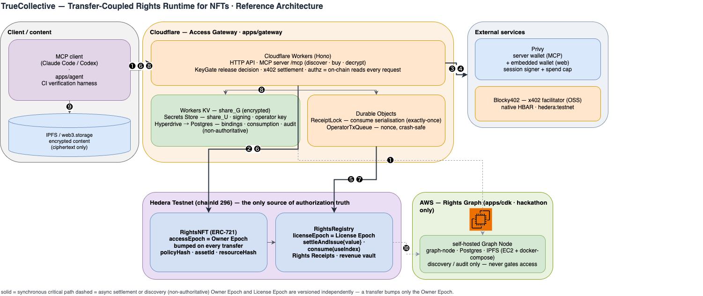
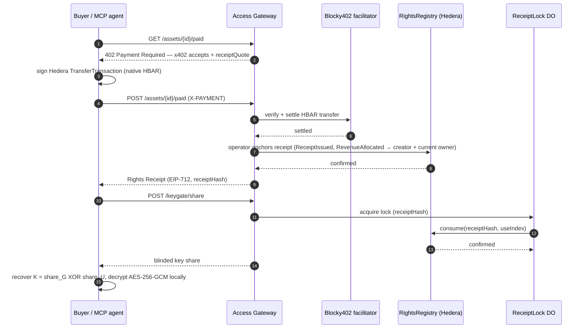

# 🐳 TrueCollective

ETHGlobal **ETHOnline 2026** submission (2026-09-04 → 2026-09-16, https://ethglobal.com/events/ethonline2026).

**Transfer the NFT. Keep eligible paid access valid. Route future revenue to the new owner.**

[Live app](https://truecollective.pages.dev/market) ·
[Demo video & ETHGlobal submission](https://ethglobal.com/showcase/truecollective-wha6k) ·
[Rights dashboard](https://truecollective.pages.dev/dashboard) ·
[Try the MCP agent flow](#ai-agent-through-mcp) ·
[Verification & evidence](#verification-status)

TrueCollective is a transfer-coupled rights runtime on Hedera Testnet. A data provider can
transfer ownership of a digital asset without interrupting customers whose purchased licenses
allow transfers. The previous owner's free access ends, the new owner's free access starts,
and new payments allocate revenue to the creator and the new owner. Previously settled
allocations remain unchanged. An AI client can discover, buy and decrypt the data through MCP.

The demo uses **synthetic Tokyo cafe data**: a recorded Claude Code run bought access for
**0.1 testnet HBAR**, decrypted nine rows and identified the highest-visitor location.
See the [recorded run and transaction links](#recorded-live-run-2026-09-08).

## What changes when ownership transfers?

| Right | Before: owner A | After: owner B |
|---|---|---|
| Free owner access | A can access | A is revoked; B can access |
| Existing `SURVIVE_TRANSFER` license | Buyer can access within its terms | Same license remains usable within its expiry, remaining uses and current license policy |
| Existing `INVALIDATE_ON_TRANSFER` license | Buyer can access within its terms | License is invalidated |
| Revenue from new purchases | Creator + A | Creator + B |
| Already-settled revenue | Allocated to the original recipients | Unchanged |

Two independent epoch counters keep ownership and usage in sync:

| Counter | Where | Bumped by | Governs |
|---|---|---|---|
| **Owner Epoch** `RightsNFT.accessEpoch(tokenId)` | ERC-721 `_update` only (no setter) | every transfer | the owner's free access |
| **License Epoch** `RightsRegistry.licenseEpoch(tokenId)` | creator / emergency revocation | policy updates | purchased Rights Receipts |

A transfer revokes the old owner, grants the new owner, keeps `SURVIVE_TRANSFER` licenses alive
until their own expiry, invalidates `INVALIDATE_ON_TRANSFER` ones, and reassigns *future* revenue
to the new owner. Purchases are x402 payments in **native HBAR** settled through the Blocky402
facilitator and anchored on `RightsRegistry` as an EIP-712 **Rights Receipt** before any key is
released (settle-before-release); every release is re-derived from chain reads on every request —
the Rights Graph (subgraph) is discovery and audit only, never an authorization source.
The recorded live MCP flow uses the default **custodial rail**: payment settlement and receipt
anchoring are separate transactions. It is **not** an atomic end-to-end payment; see the
[trust model](#trust-model-please-read-before-judging) and [verification status](#verification-status).

## System architecture



Editable source: [`docs/architecture.drawio`](docs/architecture.drawio) (draw.io / diagrams.net).

Components are grouped by hosting boundary — **Client** (an autonomous MCP client or the
`apps/agent` CI harness), **Cloudflare** (`apps/gateway`: Workers + Durable Objects + KV +
Secrets + Hyperdrive/Postgres), **Hedera Testnet** (`RightsNFT` = Owner Epoch, `RightsRegistry`
= License Epoch), **AWS** (the self-hosted Rights Graph, hackathon only), and **external
services** (Privy, Blocky402). The numbered path is the autonomous MCP `buy → decrypt` flow with
zero human steps:

1. `discover_assets` — Workers queries the Rights Graph for published assets
2. `buy_access` — Workers quotes x402 (HTTP 402 + Rights Receipt terms), reading the current
   Owner / License epochs from Hedera
3. the Privy server wallet signs a native-HBAR transfer (session signer + per-session spend cap;
   no raw key on Workers)
4. Workers settles the payment through the Blocky402 facilitator
5. `OperatorTxQueue` anchors it — `RightsRegistry.settleAndIssue` → `ReceiptIssued` +
   `RevenueAllocated` (creator + current owner)
6. `decrypt_content` — Workers re-reads `ownerOf` / `receiptStatus` from Hedera (authorization is
   never taken from cache or the subgraph)
7. `ReceiptLock` serialises the use — `RightsRegistry.consume(receiptHash, useIndex)` →
   `ReceiptConsumed` (exactly-once, even under 20-way replay)
8. KeyGate releases the blinded key share from KV (`share_G`) + Secrets (`share_U`)
9. the MCP client rebuilds `K = share_G ⊕ share_U`, fetches ciphertext from IPFS, decrypts
   AES-256-GCM locally
10. the Rights Graph indexes the new events — discovery / audit only, never gates access

The browser owner path (`apps/web`) is the same shape without steps 2–5: prove ownership,
re-read `accessEpoch`, release the share.

## Repository layout

| Package | Role | Docs |
|---|---|---|
| `apps/contracts` | Solidity 0.8.34 (Hardhat 3, OpenZeppelin 5): `RightsNFT`, `RightsRegistry` (x402 settlement, receipt lifecycle, revenue vault), deploy / seed / day-1 probe scripts | [README](apps/contracts/README.md) |
| `apps/gateway` | Access Gateway: Hono on Cloudflare Workers. Owner + licensee KeyGate, x402 rail (Blocky402), `ReceiptLock` / `OperatorTxQueue` Durable Objects, Postgres (Hyperdrive), audit log, **MCP server** at `/mcp` | [CONFIG](apps/gateway/CONFIG.md) |
| `apps/web` | Vite + React + Tailwind + Privy embedded wallet: Creator console, Market / Viewer (client-side decryption), Rights Graph dashboard, attack counter | [README](apps/web/README.md) |
| `apps/subgraph` | Rights Graph on a self-hosted Graph Node (Hedera has no Subgraph Studio support) | [README](apps/subgraph/README.md) |
| `apps/cdk` | AWS CDK: one EC2 + docker-compose running the Graph Node, **hackathon-duration only** | [README](apps/cdk/README.md) |
| `apps/e2e` | Playwright browser / attack / demo-script specs, Newman API contract suite, latency metrics | [README](apps/e2e/README.md) |
| `apps/agent` | CI verification harness: MCP client → discover / buy / decrypt → Claude analysis → harness-side verification | [README](apps/agent/README.md) |
| `packages/shared` | Cross-layer domain code (error codes, EIP-712 types + `receiptHash`, manifest schema, hashing, KeyGate maths, KV format) | — |
| `packages/openapi` | Single source of truth for the gateway HTTP API (OpenAPI 3.1 → generated types used by gateway, web, agent) | — |
| `specs/001-rights-runtime-mvp` | Spec-Driven Development artifacts (spec, plan, research, data model, contracts, tasks, quickstart, pitch Q&A) — in Japanese | [quickstart](specs/001-rights-runtime-mvp/quickstart.md) |

```bash
pnpm install
pnpm check        # biome
pnpm knip && pnpm jscpd
pnpm -r typecheck
pnpm -r test      # unit tests of every package (network-bound specs skip with a printed notice)
```

## How a purchase works (x402, native HBAR)



The sequence above describes the default **custodial rail**, used in the
[recorded live MCP run](#recorded-live-run-2026-09-08). The `settleAndIssue{value}` and
`payFor` + `finalize` alternatives collapse or move the anchoring step (see the trust model
below); that run does not verify either alternative against the live facilitator.

1. `GET /assets/{assetId}/paid` → **402** with an x402 v2 `accepts` entry: `scheme: exact`,
   `network: hedera:testnet`, `amount` in tinybar, `payTo`, and the exact Rights Receipt quote
   (`extra.receiptQuote`, nonce fixed at quote time).
2. The buyer signs a Hedera `TransferTransaction` for that amount — from the browser with the
   Privy embedded wallet, from Node with the seeded account, or from the MCP server with the
   gateway's Privy **server wallet** (session signer + spend cap, never a raw key).
3. `POST /assets/{assetId}/paid` with `X-PAYMENT` → the gateway verifies and settles the HBAR
   transfer through the **Blocky402** facilitator, then its operator anchors the receipt on
   `RightsRegistry` in a second transaction (`ReceiptIssued`, `RevenueAllocated` to creator +
   *current* owner). The receipt is returned only after that anchor is confirmed, and the payment
   binding (`payment_id`, stage, claim) makes retries idempotent. This is the default
   **custodial rail**; the contract also implements the single-transaction
   `settleAndIssue{value}` rail (payment and receipt in one call) and the `payFor` + `finalize`
   rail, selectable by `SETTLEMENT_MODE`. **Live evidence here covers the custodial flow only**;
   live facilitator verification of the two alternatives remains pending.
4. `POST /keygate/share` (licensee path) → `ReceiptLock` serialises the receipt, `consume` is
   submitted on-chain by the operator queue, and only then the blinded key share is released;
   the client recovers `K = share_G XOR share_U` and decrypts AES-256-GCM locally.

Twenty concurrent shares of the same receipt must end with **1 settled / 19 rejected**
(`RECEIPT_ALREADY_CONSUMED` / `SETTLEMENT_IN_PROGRESS`, HTTP 409), enforced by three layers:
Durable Object serialisation, a Postgres uniqueness constraint, and the contract's `consume`.
This is verified today with real parallelism in the contract suite (Hardhat) and the gateway suite
(workerd + PGlite); the same burst against the deployed gateway is the pending acceptance
criterion in `apps/e2e/attacks.e2e.ts`.

That concurrent-replay row is one of a **14-row adversarial matrix** (`specs/001-rights-runtime-mvp/contracts/error-codes.md`
§10.1: 13 deny rows across 12 unique error codes, plus 1 accept row) exercised as acceptance
tests, not just documented: reused `(receiptHash, useIndex)`, resource/policy/chain-ID hash
mismatches, an owner presenting a pre-transfer session after the NFT moved
(`OWNER_EPOCH_MISMATCH`), a policy update invalidating an in-flight receipt
(`LICENSE_EPOCH_MISMATCH`), expiry, use-limit, underpayment, and payment-ID replay - twelve rows
at the contract layer (`apps/contracts/test/AdversarialMatrix.t.sol`), the remaining rows at the
gateway's EIP-712 / chain-read layer.

The matrix itself came out of a structured multi-model adversarial review (Codex and a second
reviewer, independently): one of them, not the other, caught that the owner path's
`POST /owner/keygate` took `assetId` and `tokenId` as two separate client-supplied fields with no
check that they actually named the same asset - a cross-resource attack the licensee path already
guarded against but the owner path did not (`research.md` R-11). The fix derives `tokenId` from
`assetId` server-side (`resolveAsset`, `apps/gateway/src/routes/ownerAccess.ts`) instead of
trusting the client's value, and is now its own regression test
(`apps/gateway/test/node/release.test.ts`, "cross-resource signature ... R-11").

## AI agent through MCP

The gateway hosts an MCP server (Streamable HTTP) with three tools: `discover_assets`,
`buy_access`, `decrypt_content`, designed so an MCP client can run the whole flow with no human
step; the receipt bought in a session can only be decrypted by that session
(`MCP_SESSION_MISMATCH` otherwise), and spending is capped per session
(`MCP_SESSION_SPEND_CAP_TINYBAR`). The tools, the session binding and the cap are covered by the
gateway's unit suite (real MCP SDK transport, in-process). A live Claude Code run on
2026-09-08 completed discovery, a 0.1 testnet HBAR purchase, decryption and analysis of token #1.
The separate `apps/agent` CI acceptance run remains independently verifiable.

OAuth 2.1 authentication (dynamic client registration, PKCE S256, per-principal delegated
wallets with revocation) is implemented and live at the `/oauth/*` endpoints - see
`apps/gateway/CONFIG.md`'s "OAuth 2.1 authentication" section for the full flow. What is still
pending is the mandatory-authentication cutover itself: `MCP_AUTH_REQUIRED` controls whether a
request with no `Authorization` header at all is rejected or falls through to the legacy
unauthenticated path, and in the deployed environment it is still `false` (real secrets and a
staging run of `scripts/bootstrap-ci-oauth-client.ts` are still pending). So the connection
instructions and live run described above are the pre-remediation, unauthenticated shape: every
caller shares the one demo wallet described in "Trust model" below.

`mcp.json` for a generic client:

```json
{
  "mcpServers": {
    "rights-runtime": {
      "type": "http",
      "url": "https://truecollective-gateway.avp-104-106-107-a78.workers.dev/mcp"
    }
  }
}
```

This repository includes a project-scoped `.mcp.json`. Start Claude Code from the repository,
accept the project MCP server when prompted, and check `rights-runtime` with `/mcp`.
For another directory, register it with:

```bash
claude mcp add --transport http rights-runtime https://truecollective-gateway.avp-104-106-107-a78.workers.dev/mcp
```

Example prompt: “Discover the assets, buy token #1 once if it costs 0.1 Hedera Testnet HBAR,
then immediately decrypt it and report the row with the highest visitors count.” Keep purchase
and decryption in the same MCP connection; browser receipts or receipts from a previous
connection cannot be reused. The demo license expires 300 seconds after purchase.
The gateway's Privy wallet pays, so fund it with testnet HBAR before repeating the demo.
No Anthropic API key is required by the gateway or this MCP configuration.

### Recorded live run (2026-09-08)

- Receipt: `0x5d14b654f06dce23601e4e5916eeac0a93f6542fb3fdc7e0ec4d456122c98bd5`.
- [Purchase transaction](https://hashscan.io/testnet/transaction/0xcc4e4e96c27f3aa89db1d135410090c43a4e0b646c2c64bfec4a29eb18ebb94b) and
  [consume transaction](https://hashscan.io/testnet/transaction/0x89b04ceeadb43c8678e981925f377c88f04a28df7737022468fbd5a3a82be1c1)
  independently returned `SUCCESS` from Hedera Mirror Node, with the same receipt hash in
  issuance and consumption logs.
- Claude Code returned the decrypted synthetic Tokyo cafe dataset (9 rows), first use
  (`useIndex = 0`), and the maximum visitors row: Shinjuku, 2026-08-03, 2,401 visitors.

`apps/agent` reproduces this in CI and verifies the model's answer against the decrypted data
itself (see its README); it skips, with a notice, until a gateway and an API key are configured.

## Trust model (please read before judging)

Stated as precisely as we can (constitution VII):

- **What is trustless:** ownership, Owner / License epochs, receipt issuance, consumption
  (`useIndex`), and revenue allocation are on-chain (`RightsNFT`, `RightsRegistry`); the gateway
  re-reads `ownerOf` / `accessEpoch` / `receiptStatus` at request time, never a cache.
- **What the gateway holds:** the receipt signing key (a convenience credential; the chain is the
  authority), the operator key that submits `consume` and anchors receipts, the `share_U` half of
  each content key (Workers Secrets, handed out blinded per wallet) and the encrypted `share_G`
  half (KV). In normal operation it never assembles `K` (it lacks the wallet's KeyGate
  signature); a **compromised** gateway that reads both halves can reconstruct `K` for any asset
  and serve content on either path. That is the known residual trust point (Shamir 2-of-3 is the
  planned follow-up, not implemented). What a compromise cannot do is break the on-chain
  invariants: double-consume a `(receiptHash, useIndex)`, exceed `maxUses` / expiry /
  `licenseEpoch`, or issue a receipt without the contract's required payment.
- **KeyGate fallback:** while the plain fallback release path is enabled the gateway handles the
  full key; the demo runs the blinded-share path.
- **Availability:** the gateway is a single point of failure for key release and, on the
  custodial rail, for anchoring a settled payment (not for ownership, epochs, or revenue already
  allocated in the contract, which stay on-chain).
- **Payment rail:** the default rail is the custodial x402 settlement through Blocky402 (native
  HBAR only — the Hedera "AI & Agentic Payments" track's facilitator does not settle HTS tokens):
  between settlement and anchoring the HBAR sits with the facilitator / operator, not in the
  contract. The `payFor` + permissionless `finalize` rail keeps the deposit in `RightsRegistry`
  (non-atomic, non-custodial), and `settleAndIssue{value}` is the single-transaction rail; all
  three are implemented and selectable. The recorded live MCP run covers the custodial rail;
  the other two have no live facilitator verification recorded here
  ([rail configuration](apps/gateway/CONFIG.md)).
- **MCP wallet:** OAuth 2.1 (DCR + PKCE S256, `/oauth/*`) is implemented and covered by the
  gateway's unit suite: an authenticated caller signs purchases through their OWN
  Privy-delegated wallet (provisioned at consent, revocable per-principal or all at once,
  budgeted per principal/day in addition to the per-session cap below) - the raw wallet-signing
  key is never held by the gateway either way (the gateway DOES hold the authorization key that
  every signing request must carry; spend limits stay gateway-enforced, not Privy-enforced -
  `apps/gateway/CONFIG.md`). In the currently **deployed** environment `MCP_AUTH_REQUIRED`
  is still `false` pending the live cutover steps (real secrets, `bootstrap-ci-oauth-client.ts`
  against staging, then flipping the flag - `apps/gateway/CONFIG.md`), so the demo below still
  runs the pre-remediation, unauthenticated shape: purchases are signed by a single shared Privy
  server wallet under a per-session spend cap, and anyone who can reach the URL can spend up to
  that cap.
- **Rights Graph:** self-hosted Graph Node on AWS EC2 (`apps/cdk`), **runs only for the hackathon
  and is destroyed afterwards** with `pnpm --filter cdk destroy`. It is discovery / audit only.
- **Not supported:** contract wallets (Safe / ERC-4337, no ERC-1271), refunds of completed
  purchases (the fallback rail's `refundUnfinalized` only returns a deposit that was never
  finalized), ERC-1155, multi-chain, ZK (design only), any DRM claim, legal copyright transfer.
- **Claim scope:** TrueCollective implements request-binding, idempotency, settle-before-release
  and concurrency control in a Rights Gateway. It does not claim to have "made x402 safe".

## Deploy

| Layer | Command | Notes |
|---|---|---|
| Contracts | `pnpm --filter contracts exec hardhat run scripts/deploy.ts --network testnet`, then `pnpm --filter contracts exec hardhat run scripts/seed.ts --network testnet` | writes addresses back to `packages/shared` / subgraph config; verify on HashScan |
| Graph Node | `pnpm --filter cdk deploy` → `pnpm --filter subgraph deploy` | hackathon only; **`pnpm --filter cdk destroy` after the event** |
| Gateway | `pnpm --filter gateway deploy`, then `pnpm --filter gateway exec tsx scripts/load-shares.ts` (loads the seeded key shares into KV / secrets), then `pnpm --filter gateway deploy` again | secrets in `apps/gateway/CONFIG.md` |
| Web | `pnpm --filter web build` → Cloudflare Pages | [https://truecollective.pages.dev](https://truecollective.pages.dev); `VITE_*` in `apps/web/README.md` |

## Deployed Contract

|Contract Name|Address|Verify|
|:----|:----|:----|
|RightsNFT|[0x3524049309DC3F7f1dE83a8687a55Afa927dAe7A](https://explorer.arkhia.io/testnet/contract/0.0.10391301)|[0x3524049309DC3F7f1dE83a8687a55Afa927dAe7A](https://sourcify.dev/server/repo-ui/296/0x3524049309DC3F7f1dE83a8687a55Afa927dAe7A)|
|RightsRegistry|[0x18fD81Ef7caA46e104772B23F27351FD8748152b](https://explorer.arkhia.io/testnet/contract/0.0.10403546)|[0x18fD81Ef7caA46e104772B23F27351FD8748152b](https://sourcify.dev/server/repo-ui/296/0x18fD81Ef7caA46e104772B23F27351FD8748152b)|

## Verification status

Evidence summary updated **2026-09-13**. Historical runs are dated below; they do not imply that
every acceptance scenario has passed against the current deployment.

| Scope | Evidence / status | What it does not establish |
|---|---|---|
| MCP discovery → purchase → decryption → analysis | **Recorded live, 2026-09-08:** 0.1 testnet HBAR, receipt issuance and consumption, nine decrypted rows and Claude Code's answer. [Receipt and transaction links](#recorded-live-run-2026-09-08). | Full `apps/agent` CI acceptance, browser purchase flow, or either alternative payment rail. The run predates the mandatory OAuth cutover. |
| Contracts | Deployed on Hedera Testnet; previously verified on Sourcify. [Addresses and verification links](#deployed-contract). | A complete deployed end-to-end test run. |
| Public web and Rights Graph | **Observed 2026-09-13:** Market displayed two assets; Dashboard token #1 displayed receipts and creator/owner revenue allocations. [Open dashboard](https://truecollective.pages.dev/dashboard). | Indexed views are not authorization evidence. Browsing an existing wallet session does not verify a fresh Privy login or purchase. |
| Transfer-coupled rights | Acceptance scenarios are defined in the [E2E suite](apps/e2e/README.md): old-owner rejection, surviving paid access, and the full demo flow. | The purchase/consume run above is not proof of the complete transfer scenario; a dated deployed run covering all transitions remains to be recorded here. |
| Local tests and quality checks | [CI workflow](.github/workflows/ci.yml) includes contract/gateway/web/agent tests, real-Postgres concurrency, type checks and lint/audits. [CI runs](https://github.com/mashharuki/ethglobal-online-2026/actions/workflows/ci.yml). | A green quality job is not proof of live Hedera, browser, Newman or agent acceptance. Live jobs require their configured credentials and services. |
| CI live-deployment gate | **Fixed 2026-09-13:** the `DEPLOYED_SHA` check (does the tested commit match what is actually deployed) and a `RATE_LIMITED`-vs-security-property false failure (Playwright spec files were sharing one gateway's per-IP/per-wallet rate limit; fixed by serializing them, `apps/e2e/playwright.config.ts`) are both green as of this commit. | The suite's 20-way concurrent-replay assertion (SC-005) still fails on token #1: repeated live CI runs during this same troubleshooting session advanced its shared demo state (`accessEpoch` 1→5, one receipt's use count) past what the test assumes. A re-seed (`apps/contracts/scripts/seed.ts` → `apps/gateway/scripts/load-shares.ts`) would mint fresh demo assets and clear it, but was not run before this cutoff — token #1/#2 and the 2026-09-08 recorded evidence are otherwise unaffected. |
| OAuth and Privy controls | Delegated-wallet authentication is implemented; checked-in configuration keeps `MCP_AUTH_REQUIRED=false`. [Configuration and cutover steps](apps/gateway/CONFIG.md). | Mandatory-auth cutover and live Privy rejection of missing/invalid authorization signatures are not verified by the recorded demo. Spend limits are gateway-enforced. |

Remaining live acceptance evidence includes the full transfer flow, a fresh interactive Privy
wallet purchase, deployed replay/Playwright/Newman checks, and the autonomous CI harness run.
Skipped or blocked tests must not be reported as passed; see the [E2E prerequisites](apps/e2e/README.md).

## Prior work and disclosure (ETHOnline rules)

- Commits in this repository start on **2026-09-05** (`git log --reverse`): every file under
  `apps/` and `packages/` was committed after the event opened. That is a statement about
  repository timing, not authorship — the boilerplate listed next predates the event and was
  not written by us.
- Before the event: the design and spec documents under `specs/` and `.specify/` (written
  2026-09-02 → 03 with Spec Kit — disclosed here in full; whether pre-event spec-driven design
  falls under the AI policy's allowance for spec-driven work or under the From Scratch rule is a
  call for the organizers), the `.claude/` agent configuration, and public boilerplate copied
  from the `hedra-sample` collection of Hedera
  examples: `hardhat-erc-721-mint` (the base of `apps/contracts`' Hardhat config and the first
  mint script), `hedera-subgraph-example` (the base of `apps/subgraph`'s manifest, mappings
  pattern and Graph Node docker-compose, and of `apps/cdk`'s EC2 stack), and an x402 + Privy web
  sample (the base of `apps/web`'s Privy signer / Hedera transfer helpers). Everything specific
  to TrueCollective (contracts, gateway, MCP server, KeyGate, web routes, e2e, agent) was
  written during the event.
- AI tools: Claude Code (implementation) and Codex (review) were used throughout.

## Sponsor tracks

Hedera "AI & Agentic Payments" (x402-gated service on Hedera Testnet through Blocky402, native
HBAR), Privy "Best Financial Flow" (embedded wallet at the core of the payment flow), Privy "Best
B2B Financial Product" (Privy server wallets; delegated signer/quorum controls implemented,
mandatory-auth cutover and live rejection verification pending; spending limits enforced by the
gateway). The Graph
track is intentionally not entered (self-hosted node, Hedera unsupported by Subgraph Studio).
