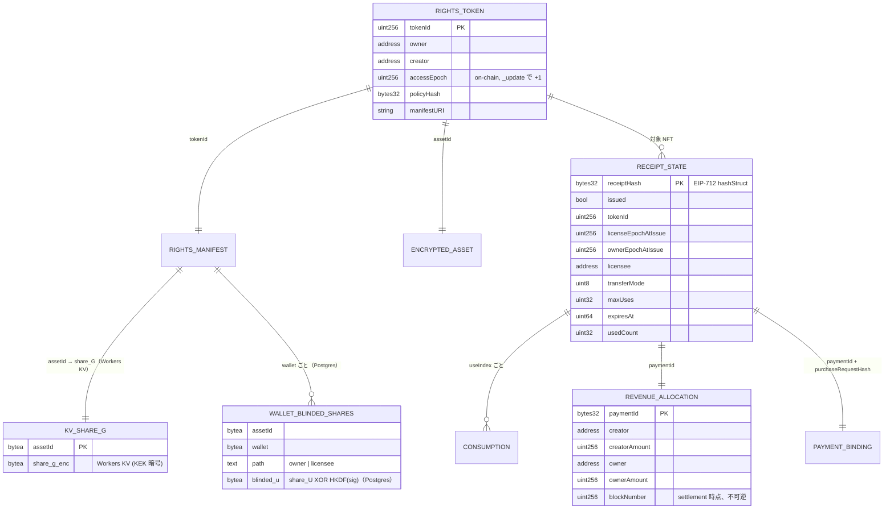

# Phase 1 データモデル: Transfer-Coupled Rights Runtime MVP

**権威の原則**：所有権・epoch・Receipt 状態・収益配分は **オンチェーン（Hedera Testnet）が唯一の真実源**（憲章 II）。Gateway（Hono on Cloudflare Workers）の Durable Object / KV / Postgres は運用データ（鍵シェア・並行制御・監査・キャッシュ）で **非権威**。

凡例：🔗 = オンチェーン、🗄 = PostgreSQL（Hyperdrive 経由）、🗝 = Workers KV、🔐 = Workers Secrets Store、📦 = IPFS。

---

## 1. オンチェーンエンティティ

### 1.1 🔗 RightsToken（`RightsNFT` コントラクト、ERC-721）

| フィールド | 型 | 説明 |
|---|---|---|
| `tokenId` | `uint256` | NFT ID |
| `owner` | `address` | 現所有者（`ownerOf`） |
| `creator` | `address` | 発行者（不変） |
| `accessEpoch[tokenId]` | `uint256` | **Owner Epoch**（概念名）。**実フィールド名は `accessEpoch`**。`_update` 内で移転時に自動 +1（唯一の更新主体、FR-001）。Receipt に埋め込む発行時スナップショットは `ownerEpochAtIssue`（EIP-712 #8）で、`INVALIDATE_ON_TRANSFER` 検証時に現在の `accessEpoch(tokenId)` と比較する。3 語は同一カウンタ（M1） |
| `policyHash[tokenId]` | `bytes32` | 現在の Rights Manifest ポリシーのハッシュ（R-6）。Creator が `setPolicy` で更新可 |
| `manifestURI[tokenId]` | `string` | Rights Manifest の場所（📦 IPFS） |
| `tokenURI(tokenId)` | `string` | 公開プレビュー + 互換メタデータ（FR-019） |

**状態遷移**

```
mint(to, creator, policyHash, manifestURI)
        │  accessEpoch = 1
        ▼
   [Owned by A]
        │  transferFrom(A, B, tokenId)
        │  _update: accessEpoch += 1   （FR-001, FR-003）
        │  emit Transfer(A, B, tokenId)
        ▼
   [Owned by B, accessEpoch = 2]
```

**不変条件**
- `accessEpoch` は単調増加。減少・巻き戻し不可。
- Indexer / Gateway / 外部の誰も `accessEpoch` を書けない（`_update` のみ）。
- `mint` 時 `accessEpoch = 1`。

**イベント**：`Transfer(from, to, tokenId)`（ERC-721 標準）、`PolicyUpdated(tokenId, oldPolicyHash, newPolicyHash)`

---

### 1.2 🔗 Receipt 状態（`RightsRegistry` コントラクト）

Receipt 本体はオフチェーンの EIP-712 データ。オンチェーンには **状態のみ** を持つ。

| フィールド | 型 | 説明 |
|---|---|---|
| `receiptHash` | `bytes32` | `RightsReceipt` struct の EIP-712 `hashStruct`（key、R-6） |
| `issued[receiptHash]` | `bool` | `settleAndIssue` で `true` に |
| `tokenId[receiptHash]` | `uint256` | 対象 NFT |
| `policyHash[receiptHash]` | `bytes32` | 発行時のポリシー |
| `licenseEpochAtIssue[receiptHash]` | `uint256` | 発行時の License Epoch |
| `ownerEpochAtIssue[receiptHash]` | `uint256` | 発行時の Owner Epoch（`INVALIDATE_ON_TRANSFER` 検証・監査用） |
| `licensee[receiptHash]` | `address` | 権利者 |
| `transferMode[receiptHash]` | `uint8` | `0 = SURVIVE_TRANSFER`, `1 = INVALIDATE_ON_TRANSFER` |
| `maxUses[receiptHash]` | `uint32` | 利用回数上限 |
| `expiresAt[receiptHash]` | `uint64` | 有効期限（unix） |
| `usedCount[receiptHash]` | `uint32` | 消費済み回数（`consume` でインクリメント、FR-007 / FR-018） |
| `consumed[receiptHash][useIndex]` | `bool` | 個別 `useIndex` の消費フラグ（`RECEIPT_ALREADY_CONSUMED` 判定） |

| `licenseEpoch[tokenId]` | `uint256` | **License Epoch**。`bumpLicenseEpoch(tokenId)`（Creator / 緊急失効）でのみ +1（FR-011 系・`LICENSE_EPOCH_MISMATCH`） |

**`hasValidConsumption(receiptHash, useIndex)` view（KeyGate 購入者パスの権威）**

```
returns true  ⟺  issued[receiptHash]
              ∧  block.timestamp < expiresAt[receiptHash]          → 否なら RECEIPT_EXPIRED
              ∧  licenseEpochAtIssue == licenseEpoch[tokenId]      → 否なら LICENSE_EPOCH_MISMATCH
              ∧  (transferMode == SURVIVE_TRANSFER
                   ∨ ownerEpochAtIssue == accessEpoch(tokenId))    → 否なら LICENSE_INVALIDATED_ON_TRANSFER
              ∧  useIndex < maxUses[receiptHash]                   → 否なら USE_LIMIT_EXCEEDED
              ∧  ¬consumed[receiptHash][useIndex]                  → 否なら RECEIPT_ALREADY_CONSUMED
```

**状態遷移**

```
settleAndIssue(auth, receiptParams) payable  ── R-2 primary：1 tx で原子的、ネイティブ HBAR
   ├─ require(msg.value == price)                        （不一致なら revert → Underpayment）
   ├─ require(!issued[receiptHash])                       （二重発行防止 / nonce）
   ├─ require(licenseEpochAtIssue == licenseEpoch[tokenId])
   ├─ owner := RightsNFT.ownerOf(tokenId)                （settlement 時点、A-5）
   ├─ RevenueAllocation を creator / owner の claimable に加算（端数規則、R-4）
   ├─ issued[receiptHash] = true; 各フィールド保存
   └─ emit ReceiptIssued(receiptHash, tokenId, policyHash, licensee, expiresAt, maxUses)
                                        │
                                        ▼
   [Issued, usedCount = 0]
                                        │  consume(receiptHash, useIndex)   （FR-007, FR-018）
                                        │  require(hasValidConsumption(receiptHash, useIndex))
                                        │  consumed[receiptHash][useIndex] = true; usedCount += 1
                                        │  emit ReceiptConsumed(receiptHash, useIndex)
                                        ▼
   [usedCount = n]  ──(usedCount == maxUses)──▶  [Exhausted]（以降 consume は USE_LIMIT_EXCEEDED）
```

**不変条件**
- `receiptHash` は 1 度だけ `issued` になる（同一 `paymentId` の二重発行防止は `nonce` + `!issued` で担保）。
- `usedCount` 単調増加、`maxUses` を超えない。
- `licenseEpoch` の bump で発行済み Receipt を検証時に無効化（`LICENSE_EPOCH_MISMATCH`）。**発行済みの `receiptHash` レコード自体は消さない**（監査のため）。

**イベント**：`ReceiptIssued`, `ReceiptConsumed`, `RevenueAllocated(tokenId, paymentId, creator, creatorAmount, owner, ownerAmount, blockNumber)`, `LicenseEpochBumped(tokenId, newEpoch)`, `Claimed(account, amount)`

---

### 1.3 🔗 RevenueAllocation（`RightsRegistry` 内、Pull 型）

| フィールド | 型 | 説明 |
|---|---|---|
| `claimable[account]` | `uint256` | 引き出し可能なネイティブ HBAR 残高（weibar、10^18 = 1 HBAR） |
| `allocationOf[paymentId]` | `struct{creator, creatorAmount, owner, ownerAmount, blockNumber}` | 監査用の不可逆記録（FR-009, FR-010） |

**状態遷移**

```
settleAndIssue → claimable[creator] += creatorAmount
              → claimable[owner]   += ownerAmount        （owner = settlement 時点の ownerOf）
              → allocationOf[paymentId] を記録（以後 変更不可）
                                        │
                                        │  claim()   （誰でも自分の分だけ、FR-009。nonReentrant / CEI）
                                        ▼
              → claimable[msg.sender] = 0；HBAR を msg.sender へ .call{value:} で送金（PayLib）
```

**不変条件**
- `creatorAmount + ownerAmount == price`（端数含め誤差 0、SC-006 / FR-022）。
- `claim()` は `allocationOf` を読み直さない（所有者の再解決なし、FR-009）。
- NFT が後で再移転されても `allocationOf[paymentId]` は不変（FR-010）。

---

## 2. オフチェーン（アプリ層）エンティティ

### 2.1 Rights Manifest（📦 IPFS、`packages/shared/manifest.ts` の zod スキーマ）

資産ごとの機械可読な条件。改ざん検知が必要なフィールドは `policyHash` / `conditionsHash` としてオンチェーン固定。

```jsonc
{
  "schemaVersion": "1.0",
  "assetId": "0x…",                       // bytes32、資産の一意 ID
  "nftContract": "0x…",
  "tokenId": "1",
  "previewURI": "ipfs://…",               // 非保護・誰でも閲覧（FR-019）
  "encryptedContentURI": "ipfs://…",      // AES-256-GCM 暗号文（本体）
  "contentHash": "0x…",                   // 暗号文の keccak256
  "keyGate": {
    "scheme": "xor-2share",
    "keyGateVersion": 1,
    "conditionsHash": "0x…",              // ownerCondition / licenseCondition の正規化ハッシュ
    "ownerCondition":   "RightsNFT.ownerOf(tokenId) == :caller && RightsNFT.accessEpoch(tokenId) == :accessEpochAtGrant",
    "licenseCondition": "RightsRegistry.hasValidConsumption(:receiptHash, :useIndex)"
  },
  "ownerAccess": { "price": "0", "durationSec": 3600 },
  "paidAccess":  { "price": "5000000000000000000", "durationSec": 300, "maxUses": 5 },   // 5 HBAR（weibar, 10^18 = 1 HBAR）
  "permissions": { "commercialUse": false, "aiTraining": true, "derivativeGeneration": true },
  "transferMode": "SURVIVE_TRANSFER",     // or INVALIDATE_ON_TRANSFER
  "revenueSplit": { "creatorBps": 3000, "ownerBps": 7000 }   // 合計 10000、2 者のみ（FR-022）
}
```

**バリデーション規則（zod）**
- `revenueSplit.creatorBps + revenueSplit.ownerBps === 10000`
- `paidAccess.maxUses >= 1`、`durationSec > 0`、`price` は 10 進整数文字列
- `transferMode ∈ {SURVIVE_TRANSFER, INVALIDATE_ON_TRANSFER}`
- `assetId`, `contentHash`, `conditionsHash` は `0x` + 64 hex

**関係**：`RightsManifest 1 — 1 RightsToken`（`tokenId`）。`policyHash` は Manifest の `paidAccess` + `ownerAccess` + `permissions` + `transferMode` + `revenueSplit` から R-6 の規則で算出し、`RightsNFT.setPolicy` で固定。

---

### 2.2 🔗📦 EncryptedContentAsset

| 表現 | 場所 | 内容 |
|---|---|---|
| 公開プレビュー | 📦 IPFS（`previewURI`） | データセットの一部・スキーマ・行数など、公開して安全な紹介（Creator が用意、FR-019） |
| 暗号文本体 | 📦 IPFS（`encryptedContentURI`） | `AES-256-GCM(K, plaintext)` + nonce + tag。MVP は独占データセット、1 ファイル ≤ 5MB、JSON/CSV（spec Assumptions） |
| `contentHash` | 🔗 `resourceHash` の入力 | 暗号文の keccak256（転用防止） |

デモ資産は **2 種**（`assetId` 別）。一方の Receipt で他方を開こうとすると `RESOURCE_HASH_MISMATCH`。

---

### 2.3 gateway ストア（Cloudflare Workers）

**すべて非権威**。並行制御・鍵シェア・監査・キャッシュのみ。バックエンドは Hono on Workers。

| ストア | 役割 |
|---|---|
| **Durable Object `ReceiptLock`**（`idFromName(receiptHash)`） | 同一 Receipt への `consume` を単一スレッドで直列化（R-3 の第 1 層）。状態は持たず「1 Receipt = 1 キュー」の実行境界としてのみ使う |
| **Workers KV** `SHARE_G`（key = `assetId`） | `share_G` を KEK（Secrets Store）で暗号化して保管。読みは `share_G` 放出時のみ |
| **Workers Secrets Store** | `share_U[assetId]` / `RECEIPT_SIGNER_KEY` / `KV_KEK` / `HEDERA_OPERATOR_KEY`（DB・KV の外、§2.4） |
| **PostgreSQL（Hyperdrive 経由、drizzle スキーマ）** | 下記テーブル。`SELECT ... FOR UPDATE` / `UNIQUE` 制約（憲章 V） |

```
-- PostgreSQL（Hyperdrive）
table wallet_blinded_shares
  asset_id            bytea
  wallet              bytea
  path                text  CHECK (path IN ('owner','licensee'))
  blinded_u           bytea NOT NULL          -- share_U XOR HKDF(sig_wallet)
  access_epoch_at_grant  numeric              -- owner パスのみ（監査・UX 表示用、認可には不使用）
  receipt_hash        bytea                   -- licensee パスのみ
  created_at          timestamptz
  PRIMARY KEY (asset_id, wallet, path)

table receipt_consumption
  receipt_hash        bytea
  use_index           integer
  wallet              bytea NOT NULL
  onchain_tx          bytea                   -- consume tx hash（確定後に埋める）
  status              text CHECK (status IN ('locked','settled','failed'))
  settled_at          timestamptz             -- consume 確定時刻。status='settled' かつ (now - settled_at) < 5min なら
                                              -- 同一 use_index への share_G 再配信を許容（consume は再送しない、spec Edge Case #1 / FR-007 / I9）
  created_at          timestamptz
  UNIQUE (receipt_hash, use_index)            -- 憲章 V

table payment_binding
  payment_id          bytea
  purchase_request_hash bytea
  receipt_hash        bytea NOT NULL
  amount              numeric NOT NULL
  created_at          timestamptz
  UNIQUE (payment_id, purchase_request_hash)  -- 憲章 V（PAYMENT_ID_PAYLOAD_CONFLICT）

table auth_nonce
  nonce               bytea PRIMARY KEY
  wallet              bytea NOT NULL
  purpose             text NOT NULL           -- 'owner-access' | 'keygate-challenge'
  chain_id            integer NOT NULL
  expires_at          timestamptz NOT NULL
  used_at             timestamptz             -- 一度使ったら埋める（FR-024）

table audit_log
  id                  bigserial PRIMARY KEY
  ts                  timestamptz
  actor               bytea
  action              text                    -- 'owner_keygate' | 'x402_settle' | 'consume' | 'deny' | 'claim' | 'policy_update'
  subject             jsonb                   -- {assetId, tokenId, receiptHash, useIndex, ...}
  outcome             text                    -- 'allow' | 'deny:<ErrorCode>'
  onchain_ref         bytea

table subgraph_cache            -- Dashboard の即時性向上のみ（authz 不使用、FR-020）
  key                 text PRIMARY KEY
  value               jsonb
  refreshed_at        timestamptz
```

**並行制御（`POST /keygate/share`、R-3 の三層）**

```
Hono handler:
  stub = env.RECEIPT_LOCK.get(env.RECEIPT_LOCK.idFromName(receiptHash))
  return stub.fetch(request)            -- 同一 receiptHash は 1 DO に集約 → DO 内で直列

ReceiptLock DO 内（1 リクエストずつ）:
  1. eth_call RightsRegistry.receiptStatus / hasValidConsumption   -- 憲章 II の権威
  2. BEGIN;
       SELECT * FROM receipt_consumption WHERE receipt_hash = $1 FOR UPDATE;   -- defense-in-depth
       use_index := usedCount(on-chain)
       INSERT INTO receipt_consumption(receipt_hash, use_index, wallet, status)
         VALUES ($1, $n, $wallet, 'locked');            -- UNIQUE 制約で二重を弾く
     COMMIT;
  3. RightsRegistry.consume($1, $n) を submit            -- オンチェーン最終権威
  4. tx 確定 → status='settled', onchain_tx=…  →  KV から share_G を取得・放出
     tx revert → status='failed'  →  custom error を ErrorCode にマップして返す
```

---

### 2.4 🔐 Workers Secrets Store（KV・DB の外）

| キー | 用途 |
|---|---|
| `share_U[assetId]` | KeyGate の client share の素。Gateway が blinding 計算時に一時参照し、平文をメモリ保持しない（R-1）。**licensee パスは発行時に破棄 → 憲章 VI 準拠。owner パスは新所有者のたびに再取得が必要なため Gateway が再取得可能＝残存信頼点**（plan.md Complexity Tracking / R-1「憲章 VI との関係」）。production は Shamir 2-of-3 |
| `RECEIPT_SIGNER_KEY` | EIP-712 Rights Receipt の署名鍵（利便クレデンシャル。偽造されてもオンチェーン `hasValidConsumption` が独立検証、`docs/idea.md` §9.1） |
| `KV_KEK` | Workers KV `SHARE_G` に入れる `share_G` の暗号化鍵 |
| `HEDERA_OPERATOR_KEY` | Gateway が `consume` / デプロイ tx を送るオペレータ鍵 |
| `PRIVY_APP_ID` / `PRIVY_APP_SECRET` | MCP 決済ウォレットの Privy server wallet 認証（session signer + spend policy、R-9 / FR-028）。**MCP 決済用の生の秘密鍵はここに置かない** ― 署名は Privy 側で行い、Gateway は policy 制約下で署名要求のみ |

---

## 3. EIP-712 typed data（`packages/shared/eip712.ts`）

**Domain**: `{ name: "TrueCollective", version: "1", chainId: 296, verifyingContract: <RightsRegistry> }`

### `RightsReceipt`（17 フィールド、憲章 V。`receiptHash` = この `hashStruct`）

| # | フィールド | 型 | |
|---|---|---|---|
| 1 | `chainId` | `uint256` | |
| 2 | `verifyingContract` | `address` | RightsRegistry |
| 3 | `nftContract` | `address` | |
| 4 | `tokenId` | `uint256` | |
| 5 | `resourceHash` | `bytes32` | R-6 |
| 6 | `policyHash` | `bytes32` | R-6 |
| 7 | `licenseEpoch` | `uint256` | 発行時 |
| 8 | `ownerEpochAtIssue` | `uint256` | 発行時（`INVALIDATE_ON_TRANSFER` 検証・監査） |
| 9 | `licensee` | `address` | |
| 10 | `permittedAction` | `uint8` | permissions ビットフラグ |
| 11 | `transferMode` | `uint8` | 0/1 |
| 12 | `maxUses` | `uint32` | |
| 13 | `expiresAt` | `uint64` | |
| 14 | `purchaseRequestHash` | `bytes32` | R-6。アクセス呼び出し内容を含めない |
| 15 | `paymentId` | `bytes32` | x402 の支払い ID |
| 16 | `nonce` | `bytes32` | 二重発行防止 |
| 17 | `issuedAt` | `uint64` | |

### `KeyGateChallenge`（`share_U` blinding 用の固定チャレンジ）

`{ assetId: bytes32, purpose: string /* "owner" | "licensee" */, receiptHash: bytes32 /* licensee のみ、owner は 0x00.. */ }`

### `OwnerAuthChallenge`（所有者アクセスの署名要求、FR-024）

`{ nonce: bytes32, chainId: uint256, tokenId: uint256, expiresAt: uint64 }`

---

## 4. エンティティ関係図



---

## 5. Subgraph エンティティ（`apps/subgraph/schema.graphql`、発見・監査のみ）

> **ホスティング**：Hedera は Subgraph Studio / Hosted Service / The Graph Market 非対応のため **自前 Graph Node** を `apps/cdk`（AWS CDK）で建てた **AWS EC2 1 台 + docker-compose**（`graph-node` + PostgreSQL + IPFS、Hedera JSON-RPC relay を provider に）で運用する。**ハッカソン期間のみの一時インフラ、終了後 `cdk destroy`**。**The Graph の賞トラックには submit しない**（要件「local-only は不可」を満たせない）。Rights Graph は Agent 発見（FR-020）と Dashboard 監査の load-bearing な技術要素として維持（R-5、憲章 v1.2.0）。

| エンティティ | 由来イベント | 主フィールド |
|---|---|---|
| `RightsToken` | `Transfer`, `PolicyUpdated` | `id(tokenId)`, `owner`, `creator`, `accessEpoch`（Transfer 数から算出）, `policyHash`, `manifestURI` |
| `TransferEvent` | `Transfer` | `token`, `from`, `to`, `blockNumber`, `timestamp` |
| `Receipt` | `ReceiptIssued` | `id(receiptHash)`, `token`, `licensee`, `policyHash`, `transferMode`, `maxUses`, `expiresAt`, `usedCount`（Consumed 数から算出） |
| `Consumption` | `ReceiptConsumed` | `receipt`, `useIndex`, `blockNumber` |
| `RevenueAllocation` | `RevenueAllocated` | `id(paymentId)`, `token`, `creator`, `creatorAmount`, `owner`, `ownerAmount`, `blockNumber` |
| `LicenseEpochChange` | `LicenseEpochBumped` | `token`, `newEpoch`, `blockNumber` |
| `Claim` | `Claimed` | `account`, `amount`, `blockNumber` |

**Agent の発見クエリ例**：`{ rightsTokens(where:{ paidAccessAvailable:true }) { id manifestURI policyHash receipt { … } } }` → Agent は `manifestURI` から価格・条件を読み、購入判断する（`FR-020`：この索引は発見のみ、認可には使わない）。
